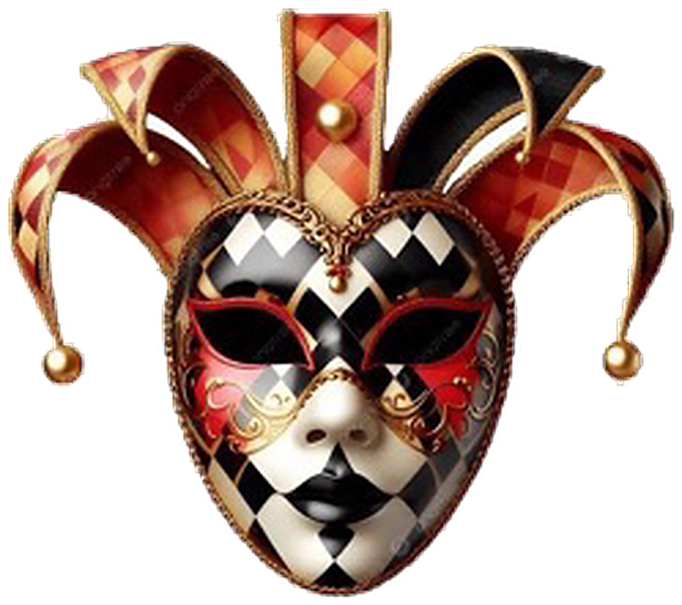

# Assignment 2 — Leader Shadi · Master Class · Leadership School Program
**Latifah Almutairi**

Two editions and a full asset library. **`index.html` is the master.** The PDFs
are exports of it.

| | |
|---|---|
| **`index.html`** | **the editable master** — 14 pages, the scrapbook as designed |
| `text-edition.html` | the reading edition — the writing alone, set for reading |
| `Assignment 2 - Latifah Almutairi - Leader Shadi.pdf` | presentation export · 14 pp · A4 · 28 MB |
| `Assignment 2 - Text Edition - Latifah Almutairi.pdf` | reading export · 12 pp · A4 · 250 KB |

---

## Nothing is flattened

Open `index.html` in any browser and you are looking at the real thing:

- **every word is live text** — select it, edit it, restyle it
- **every sticker is an ``** pointing at a file in `assets/` — swap the file
  or change the `src` and it changes
- **every position, rotation, size and opacity is an mm value in that element's
  own `style` attribute** — no override file to chase, no generated indirection

```html

```

That is the whole mechanism. Move it 5mm left: change `left`. Turn it: change
`rotate`. Swap the picture: change `src`. Reload.

The paper, the ruling, the highlighter marks, the pinned note, the bunting, the
journey map — all CSS and inline SVG. The only raster data in the document is
the artwork itself.

## Where things are

```
index.html            THE MASTER — open this
text-edition.html     the reading edition
css/
  master.css          the design system: type, colour, the ruled paper
  fonts.css           → fonts/   (Caveat + Kalam, the hand of the document)
  text-edition.css    the reading edition's typography
  fonts-reading.css   → fonts/   (EB Garamond, for continuous reading)
fonts/                8 static woff2 faces
assets/
  img001 … img049     the 49 placed images
  logos/              93 separated logo assets + a browsable index.html
  logos/index.html    open this to browse the library and see what is in use
master/               the approved original, untouched, for reference
slot-map.json         every slot, its asset, and the cue behind the choice
tools/                the build + verification pipeline
build/                pipeline working files (see build/README.txt)
```

## The one idea holding the pages together

Each `.page` carries a `lead-*` class. **Both the text leading and the pitch of
the ruled paper are driven from that single value**, so the handwriting always
sits *on* the rules rather than floating over them. A denser page simply takes a
finer rule, the way a writer reaches for a tighter-ruled sheet.

```css
.lead-air { --lead:7.60mm; }   /* the cover and the finale breathe */
.lead-open{ --lead:7.10mm; }
.lead-close{--lead:6.30mm; }
.lead-tight{--lead:5.55mm; --fs-body:13.7px; }
.lead-micro{--lead:5.05mm; --fs-body:13.2px; }   /* the densest story pages */
```

Change a page's class and the paper re-rules itself to match. Nothing else to
adjust.

## What was preserved, and what was fixed

**Preserved.** The writing is byte-for-byte identical to the approved master —
22,900 characters, verifiable by extracting the text from `master/` and from
`index.html`. The collage character, the scattered placement, the rotations and
layering, the handwritten annotations in the margins, the highlighter marks and
their colour coding, the pinned note, the bunting, the journey map, the
before/now movement through the pages, the red thread running from the cover's
map to the finale — all intact.

**Fixed.** Four things were genuinely broken in the original:

1. **The fonts never loaded.** The master asked for Caveat and Kalam from a
   `fonts/` folder that never shipped, so all fourteen pages rendered in a
   generic system cursive. Both faces are now real files in `fonts/`. Static
   instances, not variable — a variable instance cannot be subset into a PDF as
   a real font program and silently degrades to Type3 outlines.
2. **Two overlays were painting on top of the words.** `.sheet::before` and
   `::after` sat above the text in paint order, greying out every page. Folded
   into the sheet's background stack: the paper keeps its depth, the ink sits at
   full strength.
3. **The running head collided with itself.** The mark carried `class="st"`,
   whose `position:absolute` every sticker needs — so it escaped the header and
   landed on the header text.
4. **Shadowed headlines copied out doubled.** Chromium draws a `text-shadow` by
   painting the glyphs twice and both draws reach the PDF text stream, so the
   finale headline copied as `RROOLLLL WWIITTHH FFRREEEEDDOOMM`. The shadows
   were 10–12% black on cream; dropping them cost nothing and made the document
   copy cleanly.

**The image layer had to be rebuilt.** `assets/img001–img049` were referenced
but never shipped. They were restored from the project's own recovered library,
each slot chosen against **the author's own margin annotation for that slot** —
`✎ key: aim true` gets the target and dart; *Scattered Puzzle Pieces* gets the
puzzle strip; *the copies — same shape, same smile* gets literally the same
asset twice. `slot-map.json` records every choice and its cue.

## The specialty logo system

Five assets in the library were **composite sheets**: 1300×1040 grids holding
many marks at once over a baked-in transparency checkerboard. They were
segmented into **93 individual print-ready assets** at uniform resolution, each
tight-cropped with a real alpha channel. Browse them at
**`assets/logos/index.html`** — 47 are placed in the document, 46 are spare.

The cutout pipeline (`tools/extract_assets.py`):
1. classify the backdrop from the border ring;
2. mask it, then keep **only** the part touching the frame edge — so black
   inside a mask, or white inside an eye, survives;
3. feather the matte, then **un-multiply the backdrop out of the edge pixels** —
   the step that removes the dark halo that betrays a cheap cutout;
4. tight-crop, resample with Lanczos, finish with a restrained unsharp pass.

No asset's identity, colour or symbolism was altered.

## Verification

`tools/verify.mjs` is a gate, not a report. It fails on text outside the sheet,
imagery covering text, pieces outside the sheet, pieces colliding, and missing
assets. **Current status: clean.**

| check | result |
|---|---|
| approved text intact | 22,900 chars, identical to `master/` |
| text copyable from the PDF | 98.7% word match; only 2 emoji and a comma lack a text mapping |
| pages / format | 14 pp presentation, 12 pp reading, both A4 210×297 mm |
| fonts embedded | Caveat SemiBold/Bold, Kalam Regular/Bold — all TrueType |
| artwork in the PDF | lossless; the only lossy streams are 1 MB of paper texture |
| imagery covering text | none |
| assets present | 49/49 placed, 93/93 logos |

## Rebuilding

You should not need to — edit `index.html` directly. To regenerate everything
from the approved original:

```bash
./build.sh master/Assignment_2_ORIGINAL_MASTER.html
```

Needs `playwright-core` (with `NODE_PATH` pointing at it) and Python with
Pillow, numpy, scipy and pikepdf. To rebuild the image library from the original
sources: `tools/prepare_library.py` then `tools/curate.py`.

Note that `build.sh` re-solves furniture placement from scratch and will
overwrite hand-nudged positions in `index.html`. If you have been editing the
master by hand, back it up first.
